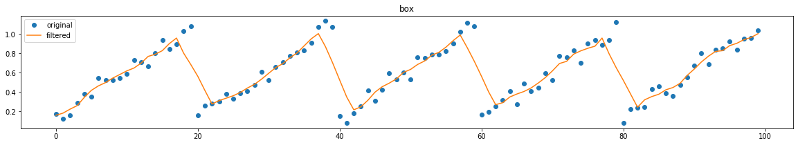
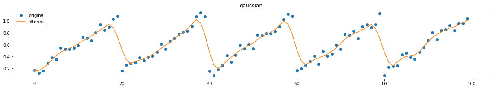
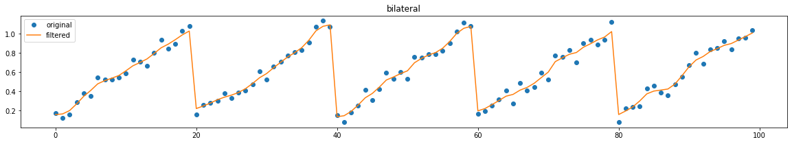

# Spatial filter for time-series data
* Implementation of [An Empirical Evaluation of Denoising Techniques for Streaming Data](https://e-reports-ext.llnl.gov/pdf/780495.pdf)
    - Box filter
    - Gaussian filter
    - Bilateral filter
    - Non local mean filter
* Only for off-line evaluation






## Requirements
* python3
* numpy
* scipy

## Basic usage
```usage.py
from tsfilt import (
    BoxFilter, GaussianFilter, BilateralFilter, IdenticalFilter, NonLocalMeanFilter
)

filt = BilateralFilter(win_size=5, sigma_d=0.1, sigma_i=0.3)
x_filt = filt.fit_transform(x)  # x: 1d array

```
see [examples](examples/example.ipynb)